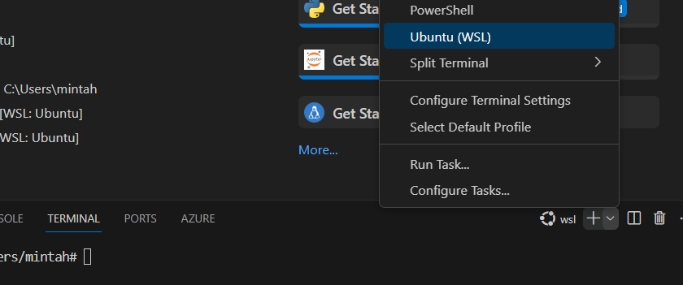

# Bun

##  Table of Contents

- [Prerequisites](#prerequisites)
  - [Windows (WSL)](#windows-wsl)
  - [Linux](#linux)
  - [macOS](#macos)
- [Running backend and frontend](#running-backend-and-frontend)
- [Tasks](#tasks)
  - [1. Installing a package](#1-installing-a-package)
  - [2. File I/O](#2-file-io)
  - [3. Bun:sqlite](#3-bunsqlite)
  - [4. Password](#4-password)

## Prerequisites
Follow the instructions below based on your operating system:

### Windows (WSL):
You can install WSL in PowerShell by using the command:
```bash
wsl --install
```
After running this, you will need to restart your computer, and then you should be able to open Ubuntu through the Windows search menu.

Next you should run commands: 
```bash
sudo apt update
sudo apt full-upgrade
``` 

Install unzip with this command:
```bash 
sudo apt-get install unzip
```

Install Bun: 
```bash
curl -fsSL https://bun.sh/install | bash
```

To run the project, we need to have Node installed. However, WSL does not come with Node installed, and the command `sudo apt install nodejs` gives a very old version of Node that may not work well with Bun. To install the current version of Node.js in WSL, use the following commands.
```bash
sudo apt-get update && sudo apt-get install -y ca-certificates curl gnupg
curl -fsSL https://deb.nodesource.com/gpgkey/nodesource-repo.gpg.key | sudo gpg --dearmor -o /etc/apt/keyrings/nodesource.gpg
NODE_MAJOR=20
echo "deb [signed-by=/etc/apt/keyrings/nodesource.gpg] https://deb.nodesource.com/node_$NODE_MAJOR.x nodistro main" | sudo tee /etc/apt/sources.list.d/nodesource.list
sudo apt-get update && sudo apt-get install nodejs -y
```

Once you have completed these steps, you can clone the repository from GitHub using HTTPS.

You can use [Visual Studio Code](https://code.visualstudio.com/docs/setup/windows) installed on Windows to edit code. Go to the project folder in the Ubuntu command line and execute the command:
```bash 
code .
```
It may ask for permission to use localhost. This will open the project in VSCode. If you use the VSCode terminal, make sure it is the Ubuntu (WSL) terminal. 

### Linux
unzip is needed to use the curl command. It can be installed with this command:
```bash 
sudo apt-get install unzip
```

Install Bun: 
```bash
curl -fsSL https://bun.sh/install | bash
```

To run the project, we need to have a relatively recent version of Node.js installed, preferably v20. To install the current version of Node.js in Ubuntu, use the following commands.
```bash
sudo apt-get update && sudo apt-get install -y ca-certificates curl gnupg
curl -fsSL https://deb.nodesource.com/gpgkey/nodesource-repo.gpg.key | sudo gpg --dearmor -o /etc/apt/keyrings/nodesource.gpg
NODE_MAJOR=20
echo "deb [signed-by=/etc/apt/keyrings/nodesource.gpg] https://deb.nodesource.com/node_$NODE_MAJOR.x nodistro main" | sudo tee /etc/apt/sources.list.d/nodesource.list
sudo apt-get update && sudo apt-get install nodejs -y
```

### macOS
Install Bun if not already: 
```bash
curl -fsSL https://bun.sh/install | bash

# Add bun to the PATH in ~/.bash_profile
echo -e '\nexport BUN_INSTALL="$HOME/.bun"\nexport PATH="$BUN_INSTALL/bin:$PATH"' >> ~/.bash_profile
source ~/.bash_profile
```
To successfully run the project, it's essential to have a relatively recent version of Node.js installed, preferably v20. Do this with Homebrew or NVM:

```bash
# Install the latest version of node with Homebrew (option 1)
brew update
brew install node
```

```bash
# Install and use the latest version of node with NVM (option 2)
nvm install --lts
nvm use --lts
```

## Running backend and frontend

In the folder `frontend` we have a very simple React frontend. Go to the frontend folder and run commands 
```bash
bun install
bun start
``` 
Open your web browser and navigate to the URL specified in the terminal where the development server is running. 


Go to folder `backend`
Run commands:
```bash
bun install
bun --hot index.ts
```

Bun supports two kinds of automatic reloading via CLI flags:
- `--watch` mode hard restarts Bun's process when imported files change.
- `--hot` mode soft reloads the code (without restarting the process) when imported files change.

If you prefer not to use automatic reloading use:
```bash
 bun run index.ts 
 ```

Don't worry, the input fields are not supposed to be functional yet.

 ## Tasks:


### 1. Installing a package

Install a npm package [faker](https://fakerjs.dev) using Bun to the backend project:
```bash
bun add @faker-js/faker
```

Modify the GET ('/') to respond with a [random hacker/IT phrase](https://fakerjs.dev/api/hacker.html#phrase) instead of the static 'Hello!' message.

Remember to use import with libraries:
```javascript
import { faker } from '@faker-js/faker';
```

Now if you reload the frontend web page the greeting from the backend should change and be a random phrase.

### 2. File I/O

### Write 

Modify POST ('/write'). Use [Bun.write](https://bun.sh/docs/api/file-io#writing-files-bun-write) to save the message from the frontend to a file `input.txt`.

After this, you should be able to use the frontend webpage to enter a new message via the "Write to file" button to write into to file `input.txt` located in the backend folder. Write something via the webpage and check the file that it changes.

### Read

Modify GET ('/read'); Use [Bun.file](https://bun.sh/docs/api/file-io#reading-files-bun-file) to read the content from file input.txt as a string, and send it to frontend.

Now you should be able to read the message via the frontend webpage by clicking the button "Read from file". Test that this works.

### 3. Bun:sqlite

### Create database
Add local SQLite database to the project using the [bun:sqlite](https://bun.sh/docs/api/sqlite#database).

[Run](https://bun.sh/docs/api/sqlite#run) with the database this query:
```typescript
  `CREATE TABLE IF NOT EXISTS Users (
    id INTEGER PRIMARY KEY AUTOINCREMENT,
    username TEXT UNIQUE NOT NULL,
    password TEXT NOT NULL
  );`,
```
After you save a .sqlite -file should appear in the backend folder. (If you are not using automatic reload you probably need to restart the backend)


### Save users
Modify that in the POST ('/register') user is saved with values from the front end to the SQLite database.

Here is an example of how to insert new rows into a table
```typescript
const insert = db.prepare("INSERT INTO Cats (name) VALUES (?)");
insert.run(name);
```


### Find a user
Add in the POST ('/login') the DB call to check if the given user credentials are correct.

Here is an example of how to get back the first result as an object:
```typescript
const cat= db.prepare('SELECT * FROM Cats WHERE name = ?').get(name) as Cat;
```

### 4. Password
In the previous exercise, we saved passwords as plain text, which is not ideal. Let's fix that. It is very simple with Bun's password API.

https://bun.sh/docs/api/hashing

### Hash
Use hashing in the POST ('/register')

Delete the .sqlite file from the backend folder, and reload the backend to create a new one that won't contain unhashed passwords.

### Verify

Use Bun.password.verify in the POST ('/login') for the password and hash from the database.